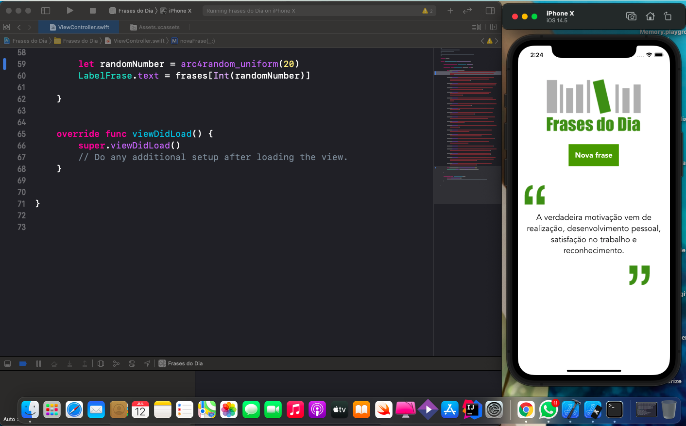

# Frases do dia

## 📋 Descrição

Nesse repositório está o projeto que desenvolvi para aprender e fixar os conhecimentos em Swift usando o Storyboard. 

Frases do dia é um app que gera frases na tela toda vez que o usuario aperta um botão.

=)

## 📲 ScreenShots

## 🖥️ Tecnologias

- Swift
- Storyboard

## 🎨 Projeto
*✓ Finalizado (sujeito a melhorias)*

##  📩 Avisos
*As frases são setadas no projeto, não consumindo nenhum tipo de API.*
